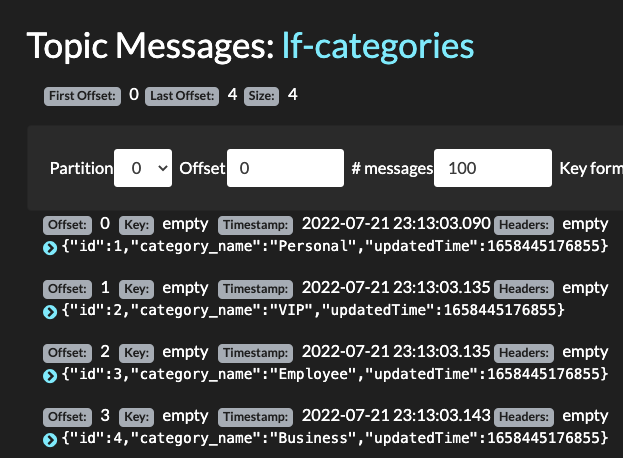
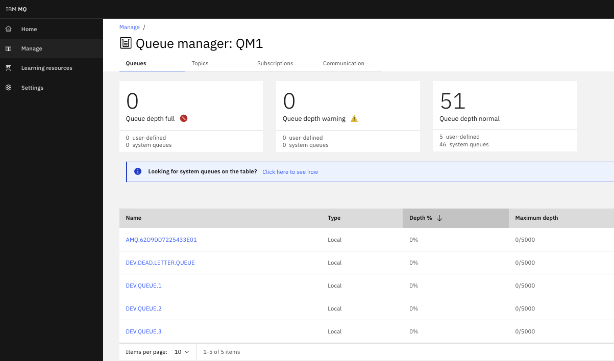
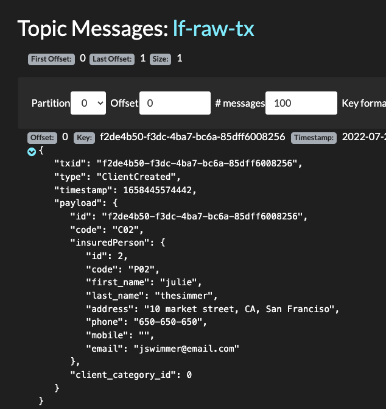

# Demonstration Script

## Goal

The goal of the demonstration is to send two messages to illustrate client creation and update message in this order. Then each message is enriched and routed to different topics.

The sequence of business operations:

* Bob TheBuilder is a new client so a web app is creating the record via a POST operation to the client management simulator
* The client record is updated by adding a beneficiary as spouce
* Then email address is changed.

We can do two type of environment:

* [Local on your laptop using docker compose](#local-execution-demonstration)
* [Once deployed on OpenShift with Event Streams and MQ](#openshift-deployment-demonstration)
## Local execution demonstration

1. Pre-requisites

    * You have docker desktop or a compatible product installed on your laptop.

1. Under the project top folder starts docker compose:

    ```sh
    # life-insurance-demo
    docker-compose up -d
    ```

1. Verify the existing topics are empty, using the open source tool called Kafdrop:


    ```sh
    chrome http://localhost:9000/
    ```

    

1. When the simulator starts, it sends the categories as reference data to the `lf-category` topic, which you can verify in Kafdrop

    

1. Configure Kafka MQ Source connector so data sent by the Simulator to MQ are moved to Kafka `lf-raw-tx` topic:

    ```sh
    cd environments/local
    ./sendMQSrcConfig.sh
    ```

1. To access the MQ Console use the following URL  

    ```sh
    chrome https://localhost:9443
    ```

    You shoud reach a login page (admin/passw0rd) and then the Home page

    

1. Send a new client creation command: which does a HTTP POST to the simulator URL `/api/v1/clients`.

    ```sh
    # under home
    ./e2e/local/sendTxToSimulator.sh ./e2e/data/client-julie.json
    ```

1. Verify the data is now in the `lf-raw-tx`

    

1. The Stream processing has routed the transaction to the `lf-tx-a` topic

1. Create a second transaction with one error (the category id is wrong), the message is routed to the dead letter queue

    ```sh
    ./e2e/local/sendTxToSimulator.sh ./e2e/data/client-bob-1.json
    ```

1. Modify the client with a business category

    ```sh
    ./e2e/local/sendTxToSimulator.sh ./e2e/data/client-bob-2.json
    ```
## OpenShift Deployment demonstration

1. Pre-requisites

    * You have te `make` tool

1. Deploy the solution with one commmand

    ```sh
    cd environments
    make all
    ``` 

    See more detail in [this section](/deployment/)

1. Verify your environments

    * Verify MQ source connector is ready

    ```sh
    oc get kafkaconnectors  
    # Output>
    # NAME        CLUSTER                CONNECTOR CLASS                                           MAX TASKS   READY
    # mq-source   eda-kconnect-cluster   com.ibm.eventstreams.connect.mqsource.MQSourceConnector   1           True
    ```

    * Deeper view of the connector

    ```sh
    oc describe kafkaconnector mq-source
    ```


1. Access the Simulator App

    ```sh
    chrome 
    ```

    

1. Access the Simulator APIs by clicking on q/swagger-ui link from the home page:

    

1. Use the POST on `/api/v1/clients` to send a client creation command with the following data:

    ```json
        "id": "101012",
        "code": "C02",
        "insuredPerson": {
            "id": 2,
            "code": "P02",
            "first_name": "julie",
            "last_name": "thesimmer",
            "address": "10 market street, CA, San Franciso",
            "phone": "650-650-650",
            "mobile": "",
            "email": "jswimmer@email.com"
        }, 
        "client_category_id": 1
    ```

    The request:

    

    The response with a populated id:

    

1. Verify the message reaches the Kafka topic named `lf-raw-tx`

    