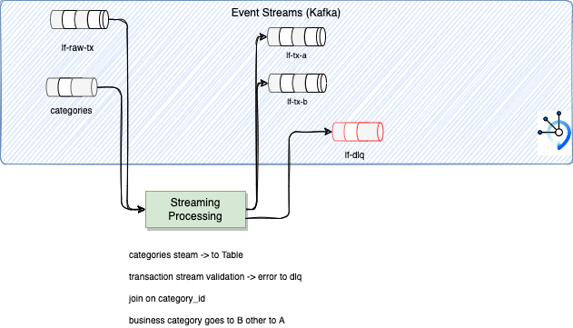

# Solution Design

## Simple domain model for client

We can use a simple client model to define a life insurance client that can have different benifeciary or transfer the life insurance to other persons. The model can be see as:


Life insurance policy can be transferred to a family member or someone else, therefore the model stores not only information about the client to whom the policy belongs but also information about any related people and their relationship to the client.

Client information is in `Person` objecr, but also as a `Client`. Other people related to the client to whom the policy may be transferred or who may receive the policy benefit upon the client’s death are also `Person`s.

Client Category is to be able to classify client for marketing reason based on demographics and financial details.

The remaining two classes are needed for describing the nature of the relationship between clients and other people.  Relation types is stored in the `ClientRelationType`. 

The `ClientRelated` instances store references to the client (client_id), the related person (person_id), the nature of that relation (client_relation_type_id), all addition details (details), if any, and a flag indicating whether the relation is currently active (is_active).

The java classes for this model are in the `lf-tx-simulator` project.

In the future, can extend this model with the Life Insurance offer and product.

Model inspiration is coming from [Vertabelo blog](https://vertabelo.com/blog/life-insurance-data-model/)


## Transaction Simulator

The code is under the folder [lf-tx-simulator](https://github.com/jbcodeforce/life-insurance-demo/tree/main/lf-tx-simulator) and use JMS API to interact with MQ.

 

The main class is in [MQProducer.java](https://github.com/jbcodeforce/life-insurance-demo/blob/main/lf-tx-simulator/src/main/java/org/acme/infra/messages/MQProducer.java) and expose a send(client) method with the domain class and prepare a transaction event message. The following code extract illustrates this:

```java
      // this is more a demo trick. Should think of a better implementation
      TransactionEvent tx = new TransactionEvent();
      if (newClient) {
        tx.type = TransactionEvent.TX_CLIENT_CREATED;
      } else {
        tx.type = TransactionEvent.TX_CLIENT_UPDATED;
      }
        
      tx.payload = client; 
      tx.txid = client.id;
      tx.timestamp = new Date().getTime();
      String msg = parser.writeValueAsString(tx);
      TextMessage message = jmsContext.createTextMessage(msg);
      message.setJMSCorrelationID(client.id);
      producer.send(destination, message);
```     

The transaction event adds meta data and supports generic payload. We may replace it with [CloudEvent](https://cloudevents.github.io/sdk-java/core.html).

The code is using the JMSCorrelationID to define the potential Key to be used by Kafka producer. We will detail that in next section.

The rest of this application exposes a REST resource to control the simulation and sends some new client data or update to existing client's one. The APIs should be enough to demonstrate the needed requirements.


The deployment descriptors are in the [environements/apps folder](https://github.com/jbcodeforce/life-insurance-demo/tree/main/environments/lf-demo/apps/lf-tx-simulator)
## The MQ source connector

The declaration of the Kafka connect cluster is done in the [environements/service folder](https://github.com/jbcodeforce/life-insurance-demo/tree/main/environments/lf-demo/services/kconnect) and the MQ source connector in [kafka-mq-src-connector.yaml](https://github.com/jbcodeforce/life-insurance-demo/blob/main/environments/lf-demo/apps/mq-source/kafka-mq-src-connector.yaml).

The interesting part of the connector configuration is the use of JMS and the JMSCorrelationID as a source for the Kafka Record key.

```yaml
    mq.record.builder: com.ibm.eventstreams.connect.mqsource.builders.DefaultRecordBuilder
    mq.connection.mode: client
    mq.message.body.jms: true
    mq.record.builder.key.header: JMSCorrelationID
```

## The Client event stream processing.

The code is in the [client-event-processing folder](https://github.com/jbcodeforce/life-insurance-demo/tree/main/client-event-processing), and supports the implementation of the green component in figure below:



The streaming algorithm is quite simple:

1. get continuous update of the category reference data: this should be rare, but the process will get any new updated to those data. This will be a Table in memory and persisted in Kafka to keep only the last update per record key. The table below illustrates the mockup data used:

    | Key | Value |
    | --- | --- |
    |  1 |  "category_name": "Personal" |
    |  2  | "category_name": "VIP" |
    | 3 | "category_name": "Employee" |
    | 4 |"category_name": "Business" |

    Topology code with GlobalKtable so if we partition the input stream we have a unique table.

    ```java
    GlobalKTable<Integer, ClientCategory> categories = builder.globalTable(categoriesInputStreamName,
                                                        Consumed.with(Serdes.Integer(),  
                                                        categorySerder),  Materialized.as(storeSupplier));
    ```

1. Process transaction events in a streams, validate the data, and any transaction in error goes to dead letter queue.

    ```json
    {
      "id": "101012",
      "code": "C02",
      "insuredPerson": {
          "id": 2,
          "code": "P02",
          "first_name": "julie",
          "last_name": "thesimmer",
          "address": "10 market street, CA, San Franciso",
          "phone": "650-650-650",
          "mobile": "",
          "email": "jswimmer@email.com"
      }, 
      "client_category_id": 1
    }
    ```

    The transaction streaming processing start with the following statements:

    ```java
    KStream<String, TransactionEvent> transactions = builder.stream(transactionsInputStreamName,
                                                        Consumed.with(Serdes.String(),  
                                                                     transactionEventSerder));
    Map<String, KStream<String, TransactionEvent>> branches = transactions
        .split(Named.as("A-"))
        .branch((k,v) -> transactionNotValid(v), Branched.as("error"))
        .defaultBranch(Branched.as("good-data"));
    ```

    This is an exactly once delivery.

1. Transform the input transaction hierarchical model into a flat model: [ClientOutput class](https://github.com/jbcodeforce/life-insurance-demo/blob/main/client-event-processing/src/main/java/org/acme/infra/events/ClientOutput.java)

    ```java
    public class ClientOutput implements JSONSerdeCompatible {
    public String client_id;
    public String client_code;
    public Integer client_category_id;
    public String client_category_name;
    public String first_name;
    public String last_name;
    public String address;
    public String phone;
    public String mobile;
    public String email;
    ```

    Data transformation is simple:

    ```java
    branches.get("A-good-data")
        .mapValues(v ->  buildClientOutputFromTransaction(v))
    ```
    
1. Enrich with the category name by doing a join with the categories table

    ```java
     .join(categories,
            (txid,co) -> co.client_category_id,
            //When you join a stream and a table, you get a new stream
            (oldOutput,matchingCategory) -> new ClientOutput(oldOutput,matchingCategory.category_name)
        )  
    ```

1. Route based on category name content to different target.

    ```java
     .branch( (k,v) -> v.client_category_name != null && v.client_category_name.equals("Business"), Branched.as("category-b"))
        .defaultBranch(Branched.as("category-a"));

    ```

The deployment descriptors are in the [environments/apps/client-event-processing folder](https://github.com/jbcodeforce/life-insurance-demo/tree/main/environments/lf-demo/apps/client-event-processing) 


[>>> Next: demonstration script](./demo.md)