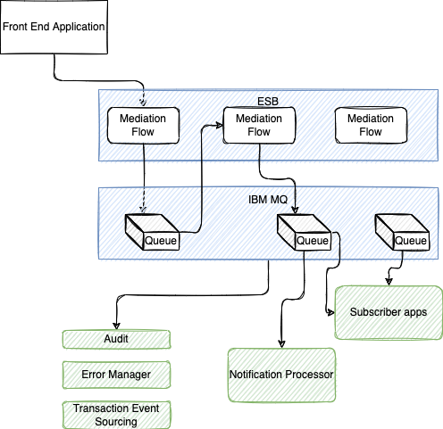
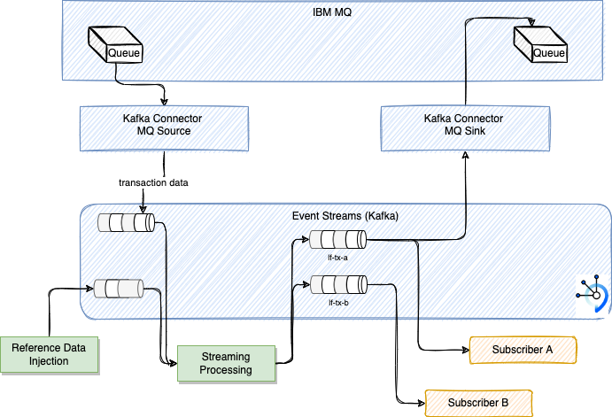
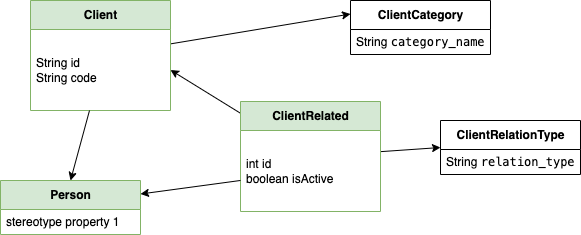
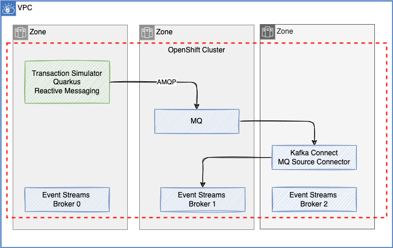

# Life insurance demonstration

This repository includes a simple example of how to integrate with an existing MQ based framework that manage message distribution between MQ applications, in life insurance domain, to plug eventing capabilities like IBM Event Streams (Kafka) with minimum disruption.

## Architecture context

Existing solution integrate a queueing framework that receive message from different applications (front end / mobile for the most part) in a Life insurance domain. This framework helps to support error management, retry, notification, data transformation, data life cycle and governance.

The ask is to see how event-driven architecture will help to support some of the capability of the framework or complement it.

Figure below illustrate a generic view of how the existing framework is running:

* At the top we have different front end applications that can send transactional data (write to life insurance model), or not transactional
* The APIs consumed by the front end could be mediated with ESB (IBM IIB) flows, and then some are publishing messages to IBM MQ queues. 
* From those queues, we can get different processing running all together to do data enrichment, transformation, to get subscriber applications consuming those data.
* Other services are responsible to do retries, auditing, manage errors, or notify end user with a mobile push or email back-end 
* An important component of this framework is the transaction event sourcing capability: keep state of change on some interesting transactional data: for example a life insurance offer.

Different flows are doing the needed works, and all this framework is basically supporting long running transaction processing and notification engine.

Also note, that to be generic this framework defines different mesage type (600) and adapt mediation flow via configuration.

The solution in on bare metal or VM running on premise.
## Requirements to demonstrate

* Address how to extend existing architecture with Kafka based middleware and streaming processing
* Demonstrate streaming processing with the exactly once delivery
* Ensure Event order is not changed: in the queuing approach with subscription, it is possible that a message arrived after another one could be processed before the first one is completed, which could impact data integrity.
* Demonstrate Data transformation to target different models, to prepare the data for a specific subscriber (a kafka consumer)
* Support message content based routing
* Dead letter queue support for data in error
* Support CloudEvent.io to present metadata around the message
* Support Schema management in registry to control the definition of the message in a unique central repository
* Demonstrate access control to topic

## Example of non-desruptive integration

The existing framework can be extended by adding Kafka MQ source and sink connectors and then deploy Kafka based middleware (IBM Event Streams) so transactional or non-transactional data will be in different Kafka Topic.

* For the streaming processing, we propose to do data enrichment, data validation to route erranous data to dead-letter-queue, and data transformation to publish to two different topics for downstream subscribers: these will validate content based routing and enrichment, and exactly once delivery with order guarantee.

???- "Read more"
    * To understand Kafka topic - offset [see this note](https://ibm-cloud-architecture.github.io/refarch-eda/technology/kafka-overview/#topics)
    * Kafka [MQ Source connector lab](https://ibm-cloud-architecture.github.io/refarch-eda/use-cases/connect-mq/)
## Domain model

We can use a simple client model to define a life insurance client that can have different benifeciary or transfer the life insurance to other persons. The model can be see as:

Life insurance policy can be transferred to a family member or someone else, therefore the model stores not only information about the client to whom the policy belongs but also information about any related people and their relationship to the client.

Client information is in `Person` objecr, but also as a `Client`. Other people related to the client to whom the policy may be transferred or who may receive the policy benefit upon the client’s death are also `Person`s.

Client Category is to be able to classify client for marketing reason based on demographics and financial details.

The remaining two classes are needed for describing the nature of the relationship between clients and other people.  Relation types is stored in the `ClientRelationType`. 

The `ClientRelated` instances store references to the client (client_id), the related person (person_id), the nature of that relation (client_relation_type_id), all addition details (details), if any, and a flag indicating whether the relation is currently active (is_active).

The java classes for this model are in the `lf-tx-simulator` project.

In the future, can extend this model with the Life Insurance offer and product.

Model inspiration is coming from [Vertabelo blog](https://vertabelo.com/blog/life-insurance-data-model/)
## Components 

We will leverage the following IBM Products:

* Event Streams with one cluster definition is in [this eventstreams-dev yaml](https://github.com/jbcodeforce/life-insurance-demo/blob/main/environments/lf-demo/services/ibm-eventstreams/base/eventstreams-dev.yaml)
* MQ broker with AMQP protocol enabled (See [this folder](https://github.com/jbcodeforce/life-insurance-demo/tree/main/environments/lf-demo/services/ibm-mq/base) for deployment example)
* [Kafka Connector](https://github.com/jbcodeforce/life-insurance-demo/tree/main/environments/lf-demo/services/kconnect)
* [Event end point management]()
* Schema registry

And develop three components:

* A transaction simulator to send data to MQ to support different demonstration goals. The app is done in Java reactive messaging using AMQP protocol
* a Kafka streaming processing
* Configuration for MQ source connector
### Transaction Simulator as source to MQ

The code is under the folder [lf-tx-simulator](https://github.com/jbcodeforce/life-insurance-demo/tree/main/lf-tx-simulator).

 

???- "More reading"
    * [Building reactive Java apps with Quarkus and IBM MQ](https://developer.ibm.com/tutorials/mq-building-cloud-native-reactive-java-messaging-applications/)
    * [Quarkus AMQP 1.0 Quickstart](https://quarkus.io/guides/amqp)